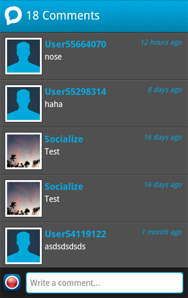
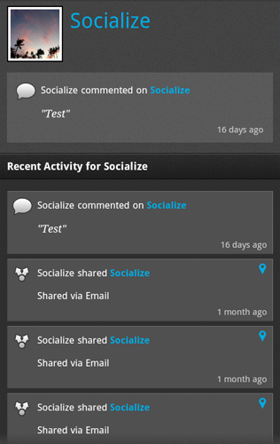

.. include:: header.inc
	
==================
Socialize Comments
==================

v0.4.0 of the Socialize SDK introduced the "Comment View" which provides the creation and viewing 
of comments associated with an entity (URL).  

.. image:: images/profile.png		

Diplaying the Comment View
~~~~~~~~~~~~~~~~~~~~~~~~~~

When you want to launch the comment view, simply call **showCommentView** from the SocializeUI instance:

.. include:: snippets/show_comment.txt

Here's an example of calling it on a button click:

.. include:: snippets/show_comment_onclick.txt

A Complete Example
~~~~~~~~~~~~~~~~~~

Here's a complete example in an Activity:

.. include:: snippets/show_comment_full.txt

.. include:: footer.inc	