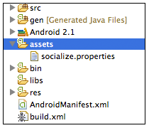
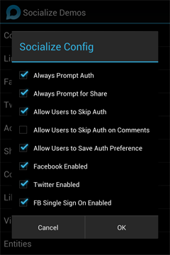

.. include:: header.inc

.. _config:	
	
======================
Configuration Settings
======================

Socialize can be easily configured via a configuration file placed in the **assets** path of your project called **socialize.properties**

Required Configuration
~~~~~~~~~~~~~~~~~~~~~~~

The following configuration options MUST be present in your **socialize.properties** file

+---------------------------------+---------+----------+----------------------------------------+------------------------------------------------------------------+
| Property                        | Type    | Default  | Example                                | Description                                                      |
+=================================+=========+==========+========================================+==================================================================+
+---------------------------------+---------+----------+----------------------------------------+------------------------------------------------------------------+
| socialize.consumer.key          | String  | None     | 12a05e3e-e522-4c81-b4bb-89d3be94d122   | Your Socialize consumer key                                      |
+---------------------------------+---------+----------+----------------------------------------+------------------------------------------------------------------+
| socialize.consumer.secret       | String  | None     | 9c313d12-f34c-4172-9909-180384c724fd   | Your Socialize consumer secret                                   |
+---------------------------------+---------+----------+----------------------------------------+------------------------------------------------------------------+

SmartAlerts Configuration
~~~~~~~~~~~~~~~~~~~~~~~~~

The following configurations are required for SmartAlerts.

+---------------------------------+---------+----------+----------------------------------------+------------------------------------------------------------------+
| Property                        | Type    | Default  | Example                                | Description                                                      |
+=================================+=========+==========+========================================+==================================================================+
+---------------------------------+---------+----------+----------------------------------------+------------------------------------------------------------------+
| socialize.entity.loader         | String  | None     | com.mypackage.MyEntityLoader           | Fully qualified class name of your entity loader implementation  |
+---------------------------------+---------+----------+----------------------------------------+------------------------------------------------------------------+
| socialize.custom.gcm.sender.id  | Number  | None     | 1234567890                             | Optional.  Use if ONLY you have your own GCM sender ID           |
+---------------------------------+---------+----------+----------------------------------------+------------------------------------------------------------------+
| socialize.comments.on.notify    | Boolean | false    |                                        | Users are directed to the comment list for comment notifications |
+---------------------------------+---------+----------+----------------------------------------+------------------------------------------------------------------+
| socialize.notification.enabled  | Boolean | true     |                                        | Enable/Disable SmartAlerts across the entire app                 |
+---------------------------------+---------+----------+----------------------------------------+------------------------------------------------------------------+

.. _auth_customize:	

Customizing Authentication Behavior
~~~~~~~~~~~~~~~~~~~~~~~~~~~~~~~~~~~

By default Socialize requires your end users to sign in to either Twitter or Facebook in order to perform a social action such as a **like** or a **comment**
This is because the value of a social action is dramatically increased if that action is propagated out to a 3rd party network.

However in some cases this may not be appropriate and in these cases you can control how Socialize handles the authentication process via configuration.

It is not necessary to change/set any of these as Socialize automatically selects reasonable defaults.

Prompting Users to Authenticate
-------------------------------

Disabling the requirement for authentication will mean that the user **is not prompted** to link to Twitter or Facebook when they perform a like or a comment.

===============================		================================================================================================================================================
.. image:: images/auth.png			The default setting is to prompt users to authenticate::
								
										socialize.require.auth=true
===============================		================================================================================================================================================

Allowing Users to Skip Authentication
-------------------------------------

===============================		================================================================================================================================================
.. image:: images/auth_skip.png		If you want to prompt users to authenticate but do not want to require that they authenticate you can do this with the following configuration::
								
										socialize.require.auth=true
										socialize.allow.anon=true
										socialize.allow.anon.comments=true
===============================		================================================================================================================================================

Forcing Authentication on Comments
----------------------------------

Many developers prefer to enforce authentication on comments to minimize *spammy* or offensive content appearing in their app, but still want to retain the 
ability for anonymous *likes*.  This can be achieved with the following configuration::

	socialize.require.auth=true
	socialize.allow.anon=true
	socialize.allow.anon.comments=false	

Allowing Users to Save their Preference
---------------------------------------

===============================		=========================================================================================================================================================
.. image:: images/auth_save.png		Enabling this configuration will give the user the option of saving their decision to **not** authenticate.  This will mean they are not prompted again::
								
										socialize.require.auth=true
										socialize.allow.anon=true
										socialize.allow.anon.comments=true
										socialize.allow.never.auth=true	
===============================		=========================================================================================================================================================

.. _share_customize:	

Customizing Sharing Behavior
~~~~~~~~~~~~~~~~~~~~~~~~~~~~

By default Socialize will prompt a user to share their action (comment or like) on a 3rd party network (e.g. Twitter or Facebook).

This behavior can be disabled with the following setting::

	socialize.prompt.share=false
	
Customizing The Comment List
~~~~~~~~~~~~~~~~~~~~~~~~~~~~

The Comment List view by default will display a header banner. 

This can be disabled with the following setting::

	socialize.show.comment.header=false		
	
Facebook Configuration
~~~~~~~~~~~~~~~~~~~~~~

+---------------------------------+---------+----------+----------------------------------------+------------------------------------------------------------------+
| Property                        | Type    | Default  | Example                                | Description                                                      |
+=================================+=========+==========+========================================+==================================================================+
+---------------------------------+---------+----------+----------------------------------------+------------------------------------------------------------------+
| facebook.app.id                 | Integer | None     | 1234567890                             | Your facebook app ID                                             |
+---------------------------------+---------+----------+----------------------------------------+------------------------------------------------------------------+
| facebook.sso.enabled            | Boolean | true     |                                        | Enable/Disable Single Sign on for Facebook                       |
+---------------------------------+---------+----------+----------------------------------------+------------------------------------------------------------------+
| facebook.og.like.enabled        | Boolean | false    |                                        | Enable/Disable Open Graph Likes                                  |
+---------------------------------+---------+----------+----------------------------------------+------------------------------------------------------------------+

Twitter Configuration
~~~~~~~~~~~~~~~~~~~~~

+---------------------------------+---------+----------+----------------------------------------+------------------------------------------------------------------+
| Property                        | Type    | Default  | Example                                | Description                                                      |
+=================================+=========+==========+========================================+==================================================================+
+---------------------------------+---------+----------+----------------------------------------+------------------------------------------------------------------+
| twitter.consumer.key            | String  | None     | U18LUnVjULkkpGoJ6                      | Your Twitter consumer key                                        |
+---------------------------------+---------+----------+----------------------------------------+------------------------------------------------------------------+
| twitter.consumer.secret         | String  | None     | RiIljnFq4RWV9LEaCM1ZLsAHf053vX2K       | Your Twitter consumer secret                                     |
+---------------------------------+---------+----------+----------------------------------------+------------------------------------------------------------------+

Google+ Configuration
~~~~~~~~~~~~~~~~~~~~~

+---------------------------------+---------+----------+----------------------------------------+------------------------------------------------------------------+
| Property                        | Type    | Default  | Example                                | Description                                                      |
+=================================+=========+==========+========================================+==================================================================+
+---------------------------------+---------+----------+----------------------------------------+------------------------------------------------------------------+
| googleplus.enabled              | Boolean | true     |                                        | Enable/Disable Google+ in Share Dialog                           |
+---------------------------------+---------+----------+----------------------------------------+------------------------------------------------------------------+

Amazon Configuration
~~~~~~~~~~~~~~~~~~~~

+---------------------------------+---------+----------+----------------------------------------+------------------------------------------------------------------+
| Property                        | Type    | Default  | Example                                | Description                                                      |
+=================================+=========+==========+========================================+==================================================================+
+---------------------------------+---------+----------+----------------------------------------+------------------------------------------------------------------+
| redirect.app.store              | String  | android  | Only 'amazon' currently supported      | Provides for creation of non Android Market urls.                |
+---------------------------------+---------+----------+----------------------------------------+------------------------------------------------------------------+

Testing Configuration Options
~~~~~~~~~~~~~~~~~~~~~~~~~~~~~

Most configuration options that affect how the UI is presented to the user can be tested in the Socialize Demo App which is provided as an Android project 
in your SDK download.  This is located in the *sample* folder of the SDK.

	
System Configuration Settings
~~~~~~~~~~~~~~~~~~~~~~~~~~~~~

+---------------------------------+---------+----------+----------------------------------------+------------------------------------------------------------------+
| Property                        | Type    | Default  | Example                                | Description                                                      |
+=================================+=========+==========+========================================+==================================================================+
+---------------------------------+---------+----------+----------------------------------------+------------------------------------------------------------------+
| http.connection.timeout         | Long    | 10000    | 10000                                  | Time in ms for an http connection to be established              |
+---------------------------------+---------+----------+----------------------------------------+------------------------------------------------------------------+
| http.socket.timeout             | Long    | 10000    | 10000                                  | Time in ms for an http request to return                         |
+---------------------------------+---------+----------+----------------------------------------+------------------------------------------------------------------+
| log.level                       | String  | WARN     | DEBUG or INFO or WARN or ERROR         | Application log level                                            |
+---------------------------------+---------+----------+----------------------------------------+------------------------------------------------------------------+

.. include:: footer.inc