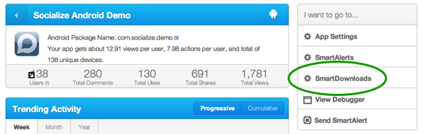
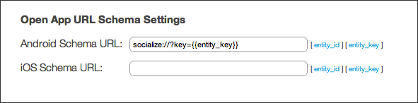

.. include:: header.inc

.. _deep_linking:	

==============
Deep Linking
==============

Introduction
------------
Deep Linking refers to the process of creating a link that appears on the web and which, when opened from a device, takes the user directly into your 
app and directly to the content referred to in the link.

Socialize provides a simple way to enable deep linking for your app(s) which means that any and all links to content shared via Socialize will be pre-configured 
to "deep link" into the content of your app.

.. note:: 

	Deep Linking requires an Entity Loader.  Refer to :ref:`entity_loader` for more details.

Enabling Deep Linking
---------------------

Enabling Deep Linking is a simple 3 step process:

Step 1 - Setup a Custom Url Scheme at getsocialize.com
~~~~~~~~~~~~~~~~~~~~~~~~~~~~~~~~~~~~~~~~~~~~~~~~~~~~~~

From your Dashboard at getsocialize.com go to the **SmartDownloads** section

Scroll to the bottom of the page to the section entitled, **Open App URL Schema Settings**

Enter a custom URL scheme.  This can be anything however for the purposes of this example we have used "socialize" as the scheme::

	socialize://?key={{entity_key}}
	
The **{{entity_key}}** portion is a place-holder into which we (Socialize) will automatically insert the entity key.

Step 2 - Create an Activity to handle custom URLs
~~~~~~~~~~~~~~~~~~~~~~~~~~~~~~~~~~~~~~~~~~~~~~~~~

You can either create a new Activity to handle deep linking (recommended) or simply add the code below to an existing activity.

.. literalinclude:: ../../../../demo/src/com/socialize/demo/snippets/EntityLoaderSnippets.java
	:start-after: begin-snippet-2
	:end-before: end-snippet-2
	
Step 3 - Configure your app to handle custom URLs
~~~~~~~~~~~~~~~~~~~~~~~~~~~~~~~~~~~~~~~~~~~~~~~~~
	
Finally configure the activity in your AndroidManifest.xml to handle URLs with this scheme

.. literalinclude:: snippets/deeplink_manifest.txt
   :language: xml
   :tab-width: 4

.. include:: footer.inc