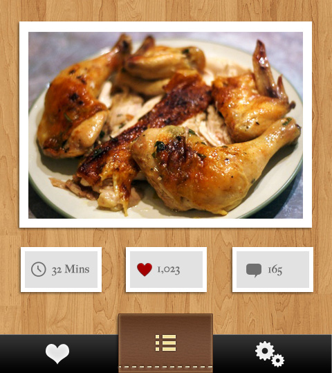

.. include:: header.inc

.. _getting_started:		
	
===============
Getting Started
===============

Introduction
------------
Socialize is a drop-in social platform for iOS and Android which allows developers to add social 
features to their app in a matter of minutes.

What's New
------------
If you're a Socialize veteran, check out our :ref:`whats_new` section for latest updates.

5 Steps to Using Socialize
--------------------------

1. Install the SDK 
==================
The Socialize SDK is delivered as a single JAR file, simply copy the socialize-x.x.x.jar file 
from the **dist** folder to the **libs** path of your Android project.

If you're using eclipse, you'll need to add the socialize-x.x.x.jar as a referenced library:

.. image:: images/library_refs.png

.. note:: Socialize supports Android v2.1 and above and does not support LDPI devices.

2. Set up your Socialize Keys
=============================
Once you have registered on the GetSocialize.com website and created an application, you will have
been given two "oAuth" authentication keys, a *consumer key* and a *consumer secret*.

Create a configuration file in the **assets** path of your project called **socialize.properties**

.. image:: images/socialize.properties.png

Within this file, enter your Socialize consumer key and secret:

.. literalinclude:: snippets/props.txt
   :language: properties

(Replace 00000000-0000-0000-000000000000 with your key/secret from your Socialize account)

3. Configure your AndroidManifest.xml
=====================================

Add the following lines to your AndroidManifest.xml within the **<manifest...>** element (above the <application...> element)

.. literalinclude:: snippets/permissions.txt
   :language: xml
   :tab-width: 4

Add the following lines to your AndroidManifest.xml within the **<application...>** element

.. literalinclude:: snippets/manifest.txt
   :language: xml
   :tab-width: 4
	
4. Configure Facebook Integration
=================================
To add Facebook authentication, you'll need a Facebook App ID.
  
If you already have a Facebook app, you can skip this section, otherwise refer to :doc:`facebook` for more information.

Once you have your facebook app ID, you can add it to the **socialize.properties** config file:

.. literalinclude:: snippets/props_fb.txt
   :language: properties
   
5. Include Socialize in your App
=================================
Now that you have your environment all setup, it's time to include Socialize.

You can either install the pre-packaged Socialize Action Bar which includes the entire suite of Socialize features in a matter of minutes

.. literalinclude:: ../../../../demo/src/com/socialize/demo/snippets/ActionBarSample.java
	:start-after: begin-snippet-0
	:end-before: end-snippet-0

Or if you prefer a more customized approach use our simple SDK interfaces to "roll your own"

Checkout the :doc:`action_bar` section for more details on the default Socialize Action Bar, or head over to the :doc:`sdk_user_guide` section to start customizing Socialize to suit your needs.

.. note:: 

	Each Action Bar instance in your app is bound to an *Entity*.  An Entity is simply an item of content in your app.
	Each Socialize action (comment, share, like etc.) is associated with an Entity.  
	
	An entity can be any item of content like a website, photo or person but MUST be given a unique key within your app.
	
	It is not necessary to explicitly create an Entity object when rendering the Action bar as this will be done for you, 
	however entities *can* be created manually.  

	Refer to the :doc:`entities` section for details on creating entities directly using the SDK.

.. raw:: html
   :file: snippets/setup_complete.html

Next Steps...
=============

Visit your App dashboard on the Socialize website to enable additional features like SmartAlerts.

http://www.getsocialize.com/apps/

.. include:: footer.inc	
