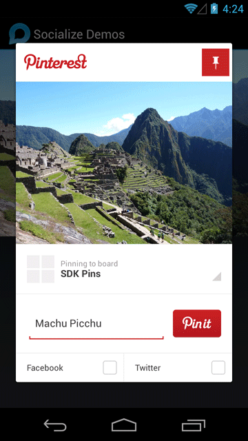

.. include:: header.inc

.. _pinterest:

====================
Sharing to Pinterest
====================

Pinterest (http://www.pinterest.com) recently released an SDK for Android what can be easily integrated into the Socialize process.

By leveraging the Socialize SmartDownload infrastructure all shares to Pinterest can be tracked and optimized along
with all other share events.

The following code snippets show how to implement a basic Pinterest *Pin*.

Step 1 - Download the Pinterest SDK
-----------------------------------
The Pinterest SDK is a single JAR file you can simply add to the *libs* folder of your Android project

http://developers.pinterest.com/android/

Step 2 - Register as a developer on Pinterest
---------------------------------------------
You will need a Pinterest Client ID to be able to call the Pinterest SDK:

http://developers.pinterest.com/developer/manage/

.. image:: images/pinterest_dev.png

Step 3 - Share to Pinterest!
----------------------------

The following is a baseline example of how to share to Pinterest.  You can modify or extend this to be triggered on the click
of a button or any other user initiated action

.. literalinclude:: ../../../../demo/src/com/socialize/demo/snippets/PinterestSnippets.java
	:start-after: begin-snippet-0
	:end-before: end-snippet-0

The Pinterest SDK is not a **direct access** API in that it does not allow posts (pins) to be made directly on the Pinterest service,
but rather it shares *via* the Pinterest App.  If the user does not have the Pinterest app installed they will be directed to
the Google Play store to download it.  If they *do* have the Pinterest app installed, they will be presented with a Pinterest screen
from which they can perform the post:

.. include:: footer.inc	
