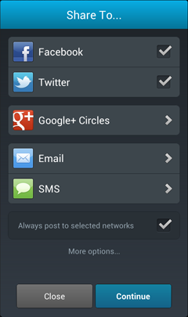
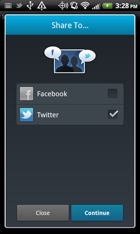
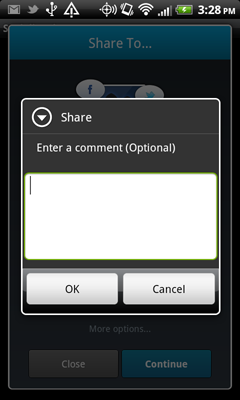

.. include:: header.inc
	
=================================
Socialize Android Developer Guide
=================================

Introduction
------------
The Socialize SDK provides a simple set of classes and methods built upon the `Socialize REST API <http://www.getsocialize.com/docs/v1/>`_

App developers can elect to use either the pre-defined user interface controls provided in the Socialize UI 
framework, or "roll their own" using direct SDK calls.

ALL calls to the Socialize SDK are *asynchronous*, meaning that your application will not "block" while 
waiting for a response from the Socialize server.

You are notified of the outcome of calls to the Socialize service via a *SocializeListener* 
passed into each call to the Socialize SDK.

Initializing Socialize (Optional)
---------------------------------
.. note:: Socialize will automatically initialize itself upon first use, however if you want more direct control over initialization you can initialize Socialize manually.

The Socialize SDK should be initialized in the **onCreate()** method of your Activity.  
You should also include the onPause and onResume methods.

.. literalinclude:: ../../../../demo/src/com/socialize/demo/snippets/SocializeInitSnippetB.java
	:start-after: begin-snippet-0
	:end-before: end-snippet-0
	
If you want to know about initialization success (e.g. if you want to access Socialize after init), you can also specify a listener

.. literalinclude:: ../../../../demo/src/com/socialize/demo/snippets/SocializeInitSnippetA.java
	:start-after: begin-snippet-0
	:end-before: end-snippet-0
	
.. _entities:	
	
Entities
--------
An entity is a single item of content in your app

Throughout the documentation and the code snippets we refer to an "entity".  This is simply a 
generic term for something that can be view, shared, liked or commented on.  Generally this will
correspond to a single item of content in your app.

Entities in Socialize MUST be associated with a unique key.  It is recommended that where possible an 
HTTP URL be used (i.e. one that corresponds to an active web page).

Using Entities
~~~~~~~~~~~~~~~~~~
When posting a comment, share or like using Socialize an entity object must be provided.  
This can either be an entity you created previously, or a new entity which will be created inline with the call to Socialize.

.. note:: You should always specify a name when creating an entity, however if you have previously created the entity with a name and do not want to specify the name every time you can provide a "null" argument for the name.  This will instruct Socialize to ignore the name attribute and the name of the entity will NOT be updated.

Creating an Entity Inline
~~~~~~~~~~~~~~~~~~~~~~~~~

A typical use of an entity might be when posting a comment.  Here the entity name is specified.

.. literalinclude:: ../../../../demo/src/com/socialize/demo/snippets/EntitySnippets.java
	:start-after: begin-snippet-0
	:end-before: end-snippet-0
	
Alternatively a **null** argument can be specified for the name which will instruct the server to leave the existing name intact.

.. literalinclude:: ../../../../demo/src/com/socialize/demo/snippets/EntitySnippets.java
	:start-after: begin-snippet-1
	:end-before: end-snippet-1

Creating an Entity Explicitly
~~~~~~~~~~~~~~~~~~~~~~~~~~~~~
An entity consists of a **key** and a **name**.  The name should be descriptive and help you identify the 
entity when viewing reports on the Socialize dashboard.

Creating an entity explicitly in this manner is **optional but recommended**.  If you simply post a 
comment,view,share or like against a key that does not currently exist, it will be automatically created 
for you.

To create an entity, simply call the **saveEntity** method:

.. literalinclude:: ../../../../demo/src/com/socialize/demo/snippets/EntitySnippets.java
	:start-after: begin-snippet-2
	:end-before: end-snippet-2
	
Retrieving Entity Data
~~~~~~~~~~~~~~~~~~~~~~
An existing entity can be retrieved via the **getEntity** method.  Entities obtained in this way will also 
provide aggregate data on comments, likes, shares and views.  Refer to the `Entity object structure in the API Docs <http://api.getsocialize.com/docs/v1/#entity-object>`_.
for more detail on these aggregate values.

.. literalinclude:: ../../../../demo/src/com/socialize/demo/snippets/EntitySnippets.java
	:start-after: begin-snippet-3
	:end-before: end-snippet-3
	
You can also retrieve several entities in one call:

.. literalinclude:: ../../../../demo/src/com/socialize/demo/snippets/EntitySnippets.java
	:start-after: begin-snippet-4
	:end-before: end-snippet-4

Entity Stats
~~~~~~~~~~~~
Each entity object retrieved from the server contains aggregate statistics about the number of comments,likes,views and shares:

.. literalinclude:: ../../../../demo/src/com/socialize/demo/snippets/EntitySnippets.java
	:start-after: begin-snippet-5
	:end-before: end-snippet-5
	
Entity Meta Data
~~~~~~~~~~~~~~~~
Entities stored in Socialize can optionally include *meta data*.  This is for any additional information you want to store about the entity.

Meta data is stored with the entity and returned then the entity is requested.

.. literalinclude:: ../../../../demo/src/com/socialize/demo/snippets/EntitySnippets.java
	:start-after: begin-snippet-6
	:end-before: end-snippet-6

If you want a more complex data structure, we recommend using JSON as an object notation

.. literalinclude:: ../../../../demo/src/com/socialize/demo/snippets/EntitySnippets.java
	:start-after: begin-snippet-7
	:end-before: end-snippet-7
	
Entity Activity
~~~~~~~~~~~~~~~

All actions performed on an entity (comment,share,like) can be retrieved using **ActionUtils**

.. literalinclude:: ../../../../demo/src/com/socialize/demo/snippets/ActionSnippets.java
	:start-after: begin-snippet-1
	:end-before: end-snippet-1

Users & User Activity
---------------------
Every device running Socialize has a "User", however Socialize automatically manages this User for you so there is no need to explicitly create one.

A User has both Settings and Activity.  The Settings correspond to the User's preferences while using Socialize whereas the Activity relates to their social actions.

Getting a User
~~~~~~~~~~~~~~	

To obtain a reference to the current user simply call the **getCurrentUser** method

.. literalinclude:: ../../../../demo/src/com/socialize/demo/snippets/UserSnippets.java
	:start-after: begin-snippet-0
	:end-before: end-snippet-0
	
To obtain a User object for a user other than the current user

.. literalinclude:: ../../../../demo/src/com/socialize/demo/snippets/UserSnippets.java
	:start-after: begin-snippet-4
	:end-before: end-snippet-4	
	
User Settings
~~~~~~~~~~~~~	
	
To allow a user to update their settings you can simply present them with the User Settings view:

.. literalinclude:: ../../../../demo/src/com/socialize/demo/snippets/UserSnippets.java
	:start-after: begin-snippet-1
	:end-before: end-snippet-1
	

If you want to build your own UI to update a User's settings you can simply call the *saveUserSettings* method

.. literalinclude:: ../../../../demo/src/com/socialize/demo/snippets/UserSnippets.java
	:start-after: begin-snippet-3
	:end-before: end-snippet-3
 
User Activity
~~~~~~~~~~~~~

You can display a profile view for any user which includes their recent activity

.. literalinclude:: ../../../../demo/src/com/socialize/demo/snippets/UserSnippets.java
	:start-after: begin-snippet-2
	:end-before: end-snippet-2
 
Or retrieve the raw list of actions performed by a user using **ActionUtils**

.. literalinclude:: ../../../../demo/src/com/socialize/demo/snippets/UserSnippets.java
	:start-after: begin-snippet-5
	:end-before: end-snippet-5
	
Or get the list of actions by a user on a single entity

.. literalinclude:: ../../../../demo/src/com/socialize/demo/snippets/ActionSnippets.java
	:start-after: begin-snippet-2
	:end-before: end-snippet-2
	
	
Application Activity
--------------------

Using the **ActionUtils** class you can also retrieve application-wide activity

.. literalinclude:: ../../../../demo/src/com/socialize/demo/snippets/ActionSnippets.java
	:start-after: begin-snippet-0
	:end-before: end-snippet-0

Sharing
-------

Socialize provides a complete set of helper functions to make sharing content in your app as easy as possible.

Default Share Dialog
~~~~~~~~~~~~~~~~~~~~

The simplest way to allow users to share an entity (your content) is via the share dialog

.. literalinclude:: ../../../../demo/src/com/socialize/demo/snippets/ShareSnippets.java
	:start-after: begin-snippet-0
	:end-before: end-snippet-0

.. _custom_share:	

Custom Share Dialog
~~~~~~~~~~~~~~~~~~~

If you just want to allow sharing to Facebook or Twitter

.. literalinclude:: ../../../../demo/src/com/socialize/demo/snippets/ShareSnippets.java
	:start-after: begin-snippet-2
	:end-before: end-snippet-2

Adding Text to a Share
~~~~~~~~~~~~~~~~~~~~~~

If you want to allow the user to add a comment when sharing but you still want to use the default UI controls 
you can implement a *Flow Interrupt* to extract text from the user before the share

.. literalinclude:: ../../../../demo/src/com/socialize/demo/snippets/ShareSnippets.java
	:start-after: begin-snippet-1
	:end-before: end-snippet-1
	
Customizing the Content of Facebook Posts
~~~~~~~~~~~~~~~~~~~~~~~~~~~~~~~~~~~~~~~~~

In some situations you may want to override the default behavior of posting to Facebook.  In these cases you can 
implement the **onBeforePost** method of the listener you pass to the ShareUtils call

.. literalinclude:: ../../../../demo/src/com/socialize/demo/snippets/ShareSnippets.java
	:start-after: begin-snippet-3
	:end-before: end-snippet-3	

Comments
--------

Displaying the Comment List UI
~~~~~~~~~~~~~~~~~~~~~~~~~~~~~~

The standard Socialize Comment List UI is included with the :doc:`action_bar` however if you wanted to create your own ActionBar or
simply want to launch the Comment List from elsewhere in your app this can simply be done with a few lines of code

.. literalinclude:: ../../../../demo/src/com/socialize/demo/snippets/CommentSnippets.java
	:start-after: begin-snippet-1
	:end-before: end-snippet-1	

You can also display the UI with a listener to handle events

.. literalinclude:: ../../../../demo/src/com/socialize/demo/snippets/CommentSnippets.java
	:start-after: begin-snippet-2
	:end-before: end-snippet-2	

Adding Comments
~~~~~~~~~~~~~~~

To create a comment programmatically you simply call the **addComment** method on **CommentUtils**

.. literalinclude:: ../../../../demo/src/com/socialize/demo/snippets/CommentSnippets.java
	:start-after: begin-snippet-0
	:end-before: end-snippet-0

You can also manually specify how the comment is to be propagated to 3rd party networks such as Facebook and Twitter 

.. literalinclude:: ../../../../demo/src/com/socialize/demo/snippets/CommentSnippets.java
	:start-after: begin-snippet-4
	:end-before: end-snippet-4

Retreiving Comments
~~~~~~~~~~~~~~~~~~~

You can retrieve existing comments by User, Entity or directly using an ID

List comments by User

.. literalinclude:: ../../../../demo/src/com/socialize/demo/snippets/CommentSnippets.java
	:start-after: begin-snippet-5
	:end-before: end-snippet-5
	
List comments by Entity
	
.. literalinclude:: ../../../../demo/src/com/socialize/demo/snippets/CommentSnippets.java
	:start-after: begin-snippet-6
	:end-before: end-snippet-6
	
List comments by ID	
	
.. literalinclude:: ../../../../demo/src/com/socialize/demo/snippets/CommentSnippets.java
	:start-after: begin-snippet-7
	:end-before: end-snippet-7

Likes
-----

Liking
~~~~~~~

To create a like programmatically you simply call the **like** method on **LikeUtils**

.. literalinclude:: ../../../../demo/src/com/socialize/demo/snippets/LikeSnippets.java
	:start-after: begin-snippet-0
	:end-before: end-snippet-0

You can also manually specify how the like is to be propagated to 3rd party networks such as Facebook and Twitter 

.. literalinclude:: ../../../../demo/src/com/socialize/demo/snippets/LikeSnippets.java
	:start-after: begin-snippet-4
	:end-before: end-snippet-4

Un-Liking
~~~~~~~~~

You can also remove a previous like from an entity

.. literalinclude:: ../../../../demo/src/com/socialize/demo/snippets/LikeSnippets.java
	:start-after: begin-snippet-1
	:end-before: end-snippet-1

Retreiving Likes
~~~~~~~~~~~~~~~~

You can retrieve existing likes by User or Entity

List likes by User

.. literalinclude:: ../../../../demo/src/com/socialize/demo/snippets/LikeSnippets.java
	:start-after: begin-snippet-5
	:end-before: end-snippet-5
	
List likes by Entity
	
.. literalinclude:: ../../../../demo/src/com/socialize/demo/snippets/LikeSnippets.java
	:start-after: begin-snippet-6
	:end-before: end-snippet-6
	

Views
-----

A "view" represents the action of a user *viewing* an entity and is an extremely useful analytics tool

Recording Views
~~~~~~~~~~~~~~~

.. literalinclude:: ../../../../demo/src/com/socialize/demo/snippets/ViewSnippets.java
	:start-after: begin-snippet-0
	:end-before: end-snippet-0

Retrieving Views
~~~~~~~~~~~~~~~~

.. literalinclude:: ../../../../demo/src/com/socialize/demo/snippets/ViewSnippets.java
	:start-after: begin-snippet-1
	:end-before: end-snippet-1

.. include:: footer.inc			
