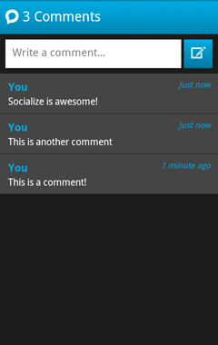

=========================================
Socialize UI (Recommended for most users)
=========================================

Introduction
------------
As of v0.4.0 of the Socialize SDK we are providing pre-built UI views that can 
quickly and easily be dropped in to your app, saving you the time of building 
these views yourself!

Configure your AndroidManifest.xml
~~~~~~~~~~~~~~~~~~~~~~~~~~~~~~~~~~
Add the following lines to your AndroidManifest.xml under the **<application...>** element

.. raw:: html

	

Add the following lines to your AndroidManifest.xml under the **<manifest...>** element

.. raw:: html

	

Initialize the Socialize UI System
~~~~~~~~~~~~~~~~~~~~~~~~~~~~~~~~~~
To incorporate the Socialize UI views into your app you need to initialize the UI system with your
Socialize app key and secret.

**NOTE:** If you are using Socialize UI exclusively (that is, you're not calling the SDK directly) 
you do not need to call **init** on the Socialize SDK yourself.  This is done for you.

First you need to specify your Socialize app key.  This can either be done in code:

.. raw:: html

	
	
Or by creating a configuration file in your **assets** path called **socialize.properties**

.. raw:: html

	

(Replace 00000000-0000-0000-000000000000 with your key/secret from your Socialize account)

Socialize Comment View
----------------------
v0.4.0 of the Socialize SDK introduced the "Comment View" which provides the creation and viewing 
of comments associated with an entity (URL).  

Currently this supports only anonymous users, but future releases will incorporate 
additional authentication systems such as Facebook and Twitter.

Diplaying the Comment View
~~~~~~~~~~~~~~~~~~~~~~~~~~

When you want to launch the comment view, simply call **showCommentView** from the SocializeUI instance:

.. raw:: html

	

Here's an example of calling it on a button click:

.. raw:: html

	

A Complete Example
~~~~~~~~~~~~~~~~~~

Here's a complete example in an Activity:

.. raw:: html

	

Socialize Action Bar
--------------------
*Coming Soon!*