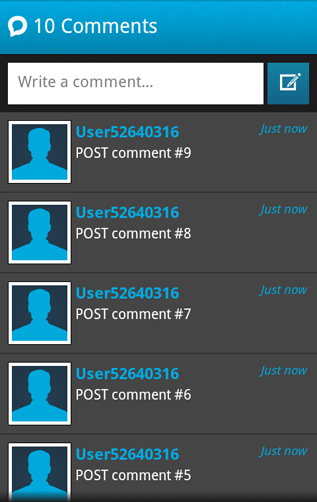
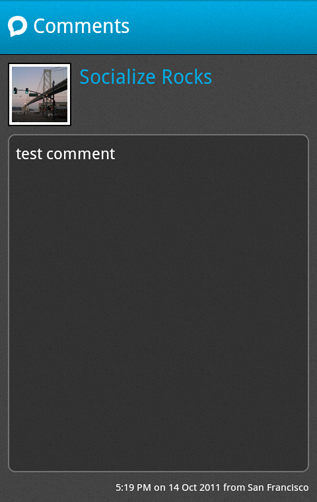

=========================================
Socialize UI (Recommended for most users)
=========================================

.. raw:: html

	
	
	

What's New!
------------
1. NEW: Facebook authentication for Comments.
2. NEW: User's can now manage their profile, including name and picture.
3. Several performance improvements and bug fixes.

Introduction
------------
As of v0.4.0 of the Socialize SDK we are providing pre-built UI views that can 
quickly and easily be dropped in to your app, saving you the time of building 
these views yourself!

Configure your AndroidManifest.xml
~~~~~~~~~~~~~~~~~~~~~~~~~~~~~~~~~~
Add the following lines to your AndroidManifest.xml under the **<application...>** element

.. raw:: html

	

Add the following lines to your AndroidManifest.xml under the **<manifest...>** element

.. raw:: html

	

Initialize the Socialize UI System
~~~~~~~~~~~~~~~~~~~~~~~~~~~~~~~~~~
To incorporate the Socialize UI views into your app you need to initialize the UI system with your
Socialize app key and secret.

**NOTE:** If you are using Socialize UI exclusively (that is, you're not calling the SDK directly) 
you do not need to call **init** on the Socialize SDK yourself.  This is done for you.

First you need to specify your Socialize app key.  This can either be done in code:

.. raw:: html

	
	
Or by creating a configuration file in your **assets** path called **socialize.properties**

.. raw:: html

	

(Replace 00000000-0000-0000-000000000000 with your key/secret from your Socialize account)

Socialize Comment View
----------------------
v0.4.0 of the Socialize SDK introduced the "Comment View" which provides the creation and viewing 
of comments associated with an entity (URL).  

.. image:: images/comment_view4.png		

Diplaying the Comment View
~~~~~~~~~~~~~~~~~~~~~~~~~~

When you want to launch the comment view, simply call **showCommentView** from the SocializeUI instance:

.. raw:: html

	

Here's an example of calling it on a button click:

.. raw:: html

	

Adding Facebook Authentication
------------------------------

It is strongly recommended that users be able to authenticate with Facebook when posting comments.

This provides significant benefits to both your application, and your users including:

1. Improved user experience through personalized comments
2. Automatic profile creation (user name and profile picture)
3. Ability to automatically post user comments to Facebook (coming soon)
4. Promotes your app on Facebook by associating your app with comments (coming soon)

To add Facebook authentication, you'll need a Facebook App ID.  If you already have a Facebook app, 
you can skip this section.

Creating a Facebook Application
~~~~~~~~~~~~~~~~~~~~~~~~~~~~~~~
If you **do not** already have a Facebook app just follow these simple steps:

	1. First create a Facebook app.  Go to https://developers.facebook.com/apps and create a new app:
	
		.. image:: images/fb_add.png
		
	2. Your newly created Facebook app will have an ID, which is the ID used in Socialize and can be found on your Facebook Developer page:
	
		For example, this is the Facebook App page for Socialize:
		
		.. image:: images/fb_id.png
		
	3. Export the hash key from your Android keystore.  All Android apps are required to be signed prior to running on a device and you will already have created a keystore while building your Android app.
		  
		Your keystore contains a public key which Facebook needs to identify your Android app.
		
		On your development machine (where you are building your Android app), run the following command to generate a key hash::

			keytool -exportcert -alias androiddebugkey -keystore ~/.android/debug.keystore 
			| openssl sha1 -binary
			| openssl base64
			
		**Make sure you use the correct key store to generate the hash**.  The example above (taken from the Facebook documentation)
		indicates use of the **debug.keystore**.  You should use whichever keystore you chose when building the version of your app 
		you are going to publish.
	
	4. Next add your key hash to your Facebook app.
		
		Paste your key into the "key hash" section of your Facebook app.
		
		.. image:: images/fb_hash.png
		
		Generally it makes sense to add BOTH your **debug** and your **release** keys to Facebook to avoid problems during development and testing.
	
You should now be ready to authenticate user's of your app with Facebook when they are using Socialize, jump to the :ref:`fb_snippet` to find out how.  	

Adding Facebook Authentication to Socialize
~~~~~~~~~~~~~~~~~~~~~~~~~~~~~~~~~~~~~~~~~~~

To add Facebook authentication, simple specify your Facebook App ID when you initialize Socialize:

.. raw:: html

	

Enabling/Disabling Facebook Single Sign On (SSO)
~~~~~~~~~~~~~~~~~~~~~~~~~~~~~~~~~~~~~~~~~~~~~~~~

Some users have reported having problems with the Single Sign On implementation in the Facebook SDK.

If you have experienced problems with this (e.g. the "invalid_key" error), you can easily disable this feature:

.. raw:: html

	

A Complete Example
~~~~~~~~~~~~~~~~~~

Here's a complete example in an Activity:

.. raw:: html

	

Socialize Action Bar
--------------------
*Coming Soon!*