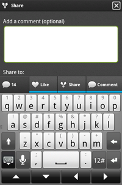
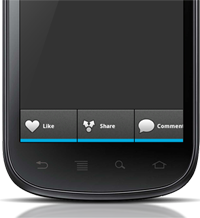

.. include:: header.inc

	
.. _support:	
	
=========================
Troubleshooting & Support
=========================

.. _debug_logs:	

Displaying debug logs in LogCat
-------------------------------
If you're having problems with loading the Action Bar, or errors at runtime the simplest way to diagnose these problems is via the 
debug logs in the Android LogCat display.

By default Socialize will only render logs of level WARN to logcat.  To override this, simply add an entry to your **socialize.properties** file:

.. literalinclude:: snippets/props_log.txt
   :language: properties

Socialize will now render more details logs to the logcat console.  All Socialize logs will be tagged with the word "Socialize" so you can 
filter them in the logcat display:

.. image:: images/logcat.png

Enabling Diagnostic Logs
------------------------

.. note:: 
	
	**SHOULD NOT BE USED IN CONJUCTION WITH DEBUG LOGS!!!**
	
	Enabling Diagnostic Logging can **SEVERLY AFFECT PERFORMANCE** and should only be enabled for specific users experiencing problems.
	
In some cases end users will experience problems that are not reproducible by you (the developer) during development or testing. In these cases it is often
difficult to determine the cause of a problem chiefly due to the fact that local system logs on the device and typically not available in remote error reporting 
systems.

To overcome this Socialize has implemented a "Diagnostic Logging" mode which, when enabled, will duplicate any log entries produced by Socialize and write them to 
an external file stored on the user's SD Card. 

Enabling Diagnostic logging is a two step process:

Step 1 - Manifest Permissions
~~~~~~~~~~~~~~~~~~~~~~~~~~~~~

Your application will require access to the SD Card in order to write diagnostic logs

.. literalinclude:: snippets/diagnostic_permissions.txt
   :emphasize-lines: 6
   :language: xml
   :tab-width: 4

Step 2 - Enable Logging
~~~~~~~~~~~~~~~~~~~~~~~

Diagnostic Logging can be enabled/disabled via ConfigUtils

.. note:: 
	
	Enabling Diagnostic Logging can **SEVERLY AFFECT PERFORMANCE** and should only be enabled for specific users experiencing problems.

.. literalinclude:: ../../../../demo/src/com/socialize/demo/snippets/ConfigSnippets.java
	:start-after: begin-snippet-0
	:end-before: end-snippet-0

Reviewing Logs
~~~~~~~~~~~~~~

When you want to be able to view the log file(s) created and would like to have the logs sent to you simply call the method provided by Socialize

.. literalinclude:: ../../../../demo/src/com/socialize/demo/snippets/ConfigSnippets.java
	:start-after: begin-snippet-1
	:end-before: end-snippet-1
	
This will present the end user with their default email client together with an attachment containing the logs.

Cleaning up Logs
~~~~~~~~~~~~~~~~

You can also optionally delete any previously created log files

.. literalinclude:: ../../../../demo/src/com/socialize/demo/snippets/ConfigSnippets.java
	:start-after: begin-snippet-2
	:end-before: end-snippet-2

Common Problems
---------------

Action Bar is does not display
~~~~~~~~~~~~~~~~~~~~~~~~~~~~~~
This is most often a result of mis-configuration in either the **AndroidManifest.xml**, or in your **socialize.properties** file.
In most cases the debug logs should give you an indication of the problem.  Refer to the above :ref:`debug_logs` section for details on displaying 
debug logs.

Action Bar is pushed up by keyboard
~~~~~~~~~~~~~~~~~~~~~~~~~~~~~~~~~~~

If you are already using a ScrollView in your layout you may have noticed that when entering text the 
ActionBar is "pushed up" by the soft keyboard like so:

You can correct this by setting **android:isScrollContainer="false"** in the declaration of your ScrollView

.. code-block:: xml

	<ScrollView 
		android:layout_width="fill_parent"
		android:layout_height="fill_parent"
		android:isScrollContainer="false">
		
		...
		
	</ScrollView>
	
Action Bar doesn't fit (appears unusually large)
~~~~~~~~~~~~~~~~~~~~~~~~~~~~~~~~~~~~~~~~~~~~~~~~

If your action bar appears too large for the display the most likely culprit is a rogue **anyDensity** setting in your **AndroidManifest.xml**

If you have the following setting in your manifest:

.. code-block:: xml

	<supports-screens android:anyDensity="false"/>

This will need to be changed to:

.. code-block:: xml

	<supports-screens android:anyDensity="true"/>
	
Or just removed completely as **false** is the default value for newer (1.6+) Android versions.

Auth Failure on Twitter
~~~~~~~~~~~~~~~~~~~~~~~

If you encounter the following error when attempting to authenticate with Twitter::

	Authentication error: Unable to respond to any of these challenges: {oauth=WWW-Authenticate: OAuth realm="https://api.twitter.com"}
	
This usually means you have not configured a **Callback URL** in your Twitter app.  Review the :doc:`twitter` section for details on adding a callback url.
	
Support and Feedback
--------------------

For direct access to our support team you can post questions on our support system here:

http://support.getsocialize.com/

.. include:: footer.inc	