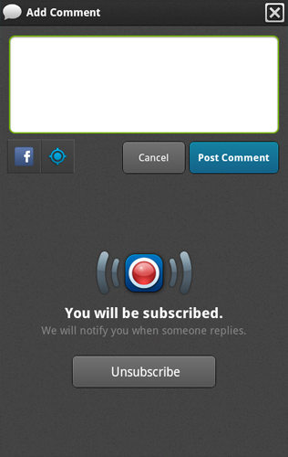
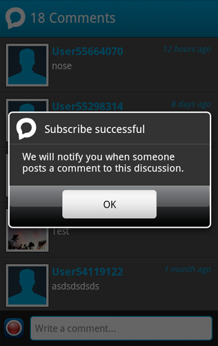

.. include:: header.inc
	
.. _whats_new:	
	
==========
What's New
==========

v1.3 Push Notifications
-----------------------
v1.3 of Socialize includes a full push notification framework designed to bring users back to your app!

Refer to the :ref:`notifications` section for details on how to implement Push Notifications.

v1.1 Recent Activity in User Profile
-------------------------------------

In v1.1 we introduced recent activity in the user profile view:

.. image:: images/profile_activity.png

This can provide a significant boost to in-app engagement, however to maximize its benefit 
developers must implement a Socialize "Entity Loader".  This provides Socialize with the information 
needed to load the original view of the entity the user acted upon.

With a Socialize Entity Loader specified, users will be able to navigate from the recent activity to 
other parts of your application.

Refer to the :ref:`entity_loader` section for details on how to implement a Socialize Entity Loader

.. include:: footer.inc	